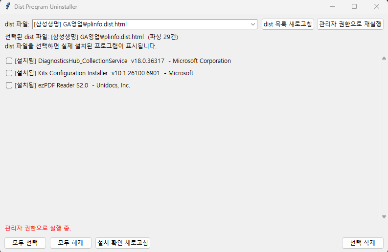

# Dist Program Uninstaller



**회사에서 사용하는 파일을 파싱**해  
해당 dist에 포함된(또는 연관된) **보안/플러그인/컴포넌트 설치 항목 이름을 추출**하고,  
PC에 **실제로 설치된 프로그램(레지스트리 기반)** 과 매칭해서 **선택 삭제(언인스톨)** 까지 수행하는 GUI 도구입니다.

---

## 핵심 동작

- `list/` 폴더 아래에서 파일 패턴으로 dist 파일을 스캔합니다.  
- dist 파일은 **HTML 껍데기를 제거**한 뒤, 내부에 포함된 `pluginInstallInfo` / `activeXInstallInfo` XML 블록을 찾거나,
  base64 payload를 디코딩해서 XML을 추출합니다.
- GUI에서 dist 파일을 선택하면, 파싱된 항목 수와 함께 **실제 설치된 프로그램 매칭 결과**가 체크리스트로 표시됩니다.
- 선택한 항목을 **QuietUninstallString/UninstallString 기반**으로 안전하게 인자 분리 후 실행합니다.  
  MSI GUID가 감지되면 `msiexec /x {GUID} /qn /norestart` 로 사일런스 삭제를 시도합니다.

---

## 요구 사항

- Windows 전용 (Python 3.9+ 권장)
- Tkinter 포함된 Python (일반 설치본이면 기본 포함)
- 레지스트리 접근 및 삭제 실행 특성상 **관리자 권한 실행 권장**

---

## 실행 방법 (개발 실행)

1) 프로젝트 루트에서 `list/` 폴더 구조를 만든 뒤 dist 파일을 넣습니다.

예시:

```text
project_root/
  dist_uninstaller.py
  list/
    siteA/
      plinfo.dist.html
    siteB/
      plinfo_ext_1.dist.html
```

> 앱은 시작 시 `list/` 폴더가 없으면 자동 생성합니다. fileciteturn3file0L47-L53

2) 실행

```bash
python dist_uninstaller.py
```

3) GUI에서:
- 상단 콤보박스에서 dist 파일 선택
- 체크 목록에서 삭제할 항목 선택
- **[선택 삭제]** 클릭 fileciteturn3file3L20-L49

---

## 빌드 (EXE)

PyInstaller로 단일 실행 파일(EXE) 빌드가 가능합니다.

```bash
pip install pyinstaller
pyinstaller DistProgramUninstaller.spec
```

> `BASE_DIR` 는 실행 파일 기준으로 `exe 위치/list` 를 사용하도록 되어 있어,  
> 빌드 후에도 exe 옆에 `list/` 폴더를 두면 동일하게 동작합니다. fileciteturn3file0L47-L53

---

## dist 파일 샘플

- `plinfo.dist.html` 처럼 **base64 본문만 있는 케이스** fileciteturn3file4L1-L11  
- `plinfo_ext_1.dist.html` 처럼 **HTML + base64가 함께 있는 케이스** fileciteturn3file11L1-L11  

---

## 주의 사항

- 이 도구는 **설치 프로그램 제거(언인스톨)** 를 실행합니다. 반드시 무엇을 삭제하는지 확인 후 사용하세요.
- 일부 프로그램은 조용한 삭제 옵션을 제공하지 않거나, 재부팅/추가 확인창이 필요할 수 있습니다.
