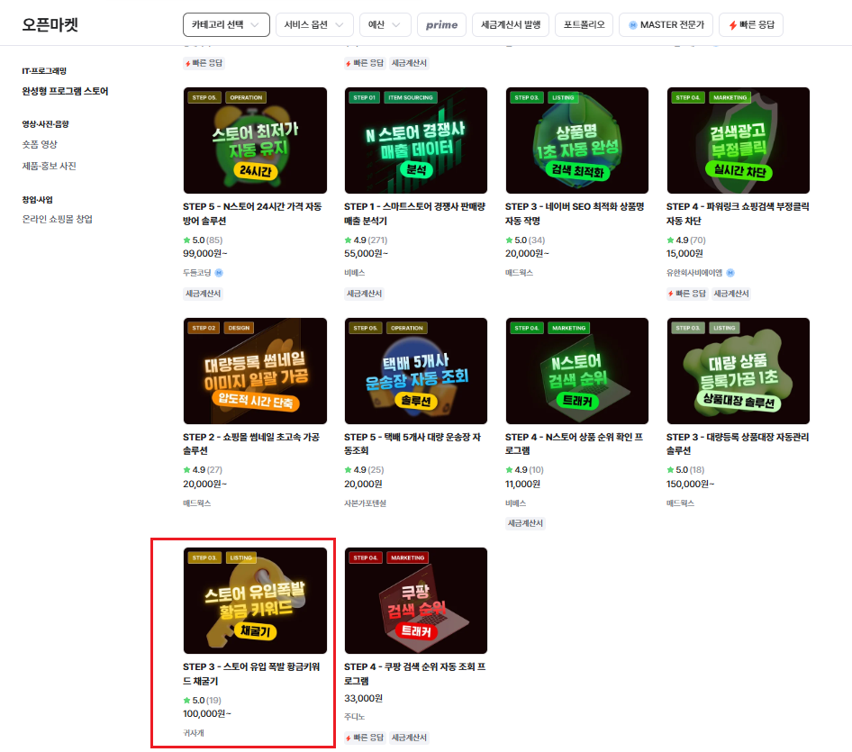
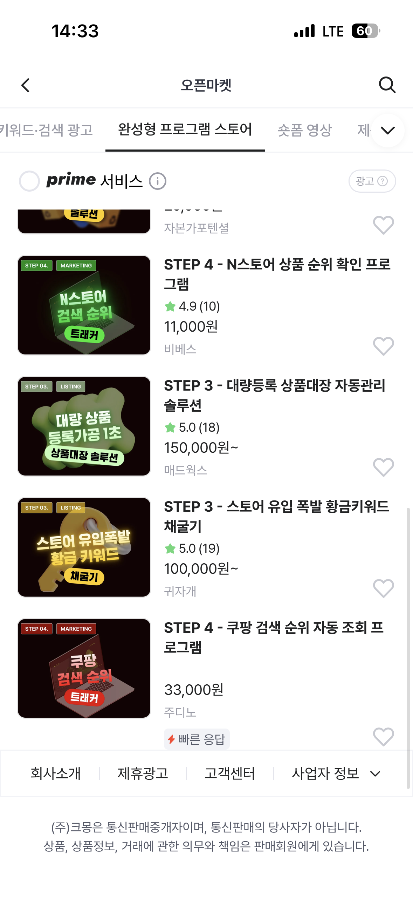

# Keyword Find (키워드 분석 도구)

Google Sheets 기반 사용자 인증과 네이버 키워드 분석 기능을 결합한  
**Streamlit 기반 키워드 리서치 도구**입니다.

단순 키워드 수집을 넘어, 로그인/플랜 권한 분기, 일반 키워드 분석,  
네이버 광고 API 기반 검색량 분석, 결과 저장 및 재조회까지 포함한  
**실사용형 SEO · 콘텐츠 기획 도구**를 목표로 구성했습니다.

<table align="center">
  <tr>
    <td colspan="2" align="center">
      <sub>크몽 ‘쇼핑몰 창업 테마관’ 파트너 선정</sub>
    </td>
  </tr>
  <tr>
    <td align="center"><sub>Web</sub></td>
    <td align="center"><sub>Mobile</sub></td>
  </tr>
  <tr>
    <td align="center">
      
    </td>
    <td align="center">
      
    </td>
  </tr>
</table>

---

## 개요
이 프로젝트는 블로그 SEO, 콘텐츠 주제 선정, 마케팅 키워드 조사에 활용할 수 있도록 만든 개인 프로젝트입니다.

사용자는 로그인 후 권한에 맞는 기능을 사용할 수 있고,  
일반 키워드 분석과 광고 API 분석 결과를 분리해서 관리할 수 있습니다.

또한 Streamlit 기반 UI로 빠르게 사용할 수 있도록 구성하면서,  
배포를 고려해 EXE 실행 구조까지 함께 설계했습니다.

---

## 흐름도

> 사용자 로그인 (Google Sheets 인증)  
> → 기능 선택  
> → 일반 키워드 분석 또는 네이버 광고 API 분석  
> → 키워드 정제 / 확장 / 결과 시각화  
> → 결과 저장 및 재조회

---

## Tech Stack

- **Python**
- **Streamlit**
- **Pandas**
- **Requests**
- **BeautifulSoup4 / lxml**
- **gspread / oauth2client**
- **PyInstaller**
- **pystray / Pillow**
- 선택: **kiwipiepy**

---

## 사용 기술 포인트

### 1) Streamlit 기반 화면 분리 구성
- 로그인 화면, 설정 화면, 기능별 결과 화면을 분리해 UI를 모듈화
- 단일 스크립트가 아니라 `views/`, `features/` 구조로 기능을 분할
- 빠른 프로토타이핑과 유지보수를 동시에 고려한 구조

### 2) Google Sheets 기반 인증/플랜 제어
- 별도 DB 없이 Google Sheets를 사용자 인증 저장소처럼 활용
- 등록된 사용자만 로그인 가능하도록 구성
- 사용자 플랜(Standard / Deluxe / Premium)에 따라 기능 노출 범위 제어
- 간단한 SaaS형 권한 관리 구조를 가볍게 구현한 방식

### 3) 일반 분석 + 광고 API 분석 분리 설계
- 일반 분석은 네이버 키워드 확장 및 문서 기반 추출 중심
- 광고 API 분석은 검색량, 모바일/PC 수치, 경쟁도 중심
- 서로 다른 성격의 분석 기능을 별도 화면과 결과 구조로 분리
- 기능 확장 시 유지보수가 쉬운 구조로 설계

### 4) HTML 파싱 및 키워드 정제 처리
- HTML 문서 파싱을 통해 텍스트를 추출하고, 분석 가능한 형태로 재가공
- 불필요한 문자열 제거, 키워드 정리, 결과 병합 등 데이터 전처리 로직 반영
- 단순 수집이 아니라 실제 활용 가능한 키워드 목록 생성에 초점

### 5) 결과 저장 및 재사용 구조
- 분석 결과를 JSON 형태로 저장해 재조회 가능
- 일반 분석 결과와 광고 분석 결과를 구분 저장
- 반복 작업 시 이전 결과를 다시 확인하고 비교하기 쉬운 구조

### 6) 배포를 고려한 엔트리 분리
- `app.py` 기반 Streamlit 실행 구조와 별도로 `run.py` 진입점 제공
- EXE 패키징을 고려해 배포 시 실행 흐름을 단순화
- 개인 사용 도구를 실제 배포형 프로그램으로 확장하기 위한 구조 반영

---

## 주요 기능

### 사용자 인증 및 권한 관리
- Google Sheets 등록 사용자 로그인
- 자동 로그인 지원
- 사용자 플랜별 기능 접근 분기

### 네이버 키워드 분석
- 자동완성 / 연관 키워드 기반 확장
- 블로그 문서 기반 키워드 추출
- 기본 / 빠른분석 / 상세분석 / 키워드확장 / 심층탐색 프리셋 제공

### 네이버 광고 API 분석
- 월간 검색량(PC / 모바일) 조회
- 경쟁도 기반 키워드 판단
- API 키 저장 후 재사용 가능
- 광고 데이터 기반 확장 키워드 탐색

### 결과 저장 및 조회
- 분석 결과 JSON 저장
- 저장된 결과 목록 조회
- 이전 분석 결과 재확인 및 비교

---

## 프로젝트 구조

```text
.
├─ app.py                     # Streamlit 메인 실행
├─ run.py                     # 배포/실행용 엔트리
├─ views/
│  ├─ login.py                # 로그인 화면
│  ├─ settings.py             # 메인 설정/대시보드
│  └─ features/
│     ├─ naver.py             # 일반 키워드 분석
│     ├─ naver_ads.py         # 광고 API 분석
│     ├─ naver_result.py      # 일반 분석 결과
│     ├─ naver_ads_result.py  # 광고 분석 결과
│     ├─ naver_list.py        # 저장 결과 목록
│     └─ naver_ads_list.py    # 광고 저장 결과 목록
├─ utils/
│  ├─ config.py               # 설정 및 경로 관리
│  ├─ naver_core.py           # 공통 분석 로직
│  ├─ naver_ads.py            # 광고 API 클라이언트
│  └─ naver_ads_api.py        # 광고 API 확장 처리
├─ config/
└─ .streamlit/
```

---

## 프로젝트 성격
- **개인 생산성 도구**
- **SEO / 콘텐츠 기획 보조 도구**
- **API 연동 + 데이터 가공 + UI 구성 + EXE 배포까지 고려한 Python 프로젝트**

---

키워드 수집 자체보다,  
**인증 / 권한 관리 / 분석 로직 분리 / 저장 구조 / 배포 구조**까지 함께 설계한 점이 특징인 프로젝트입니다.
